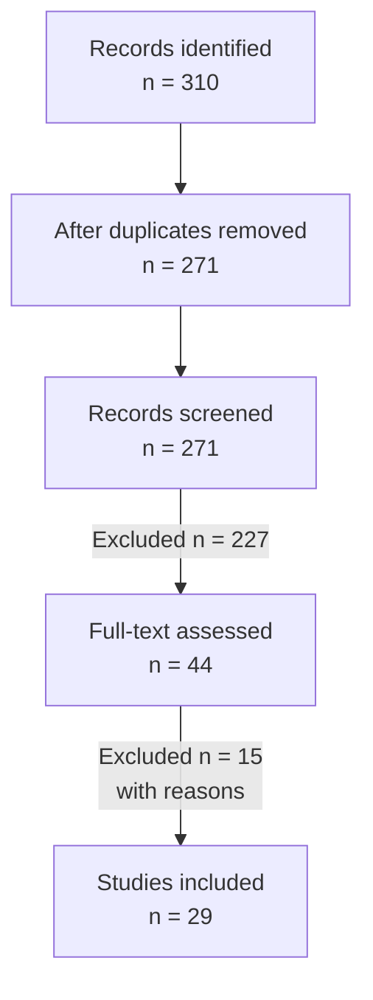

# Reproducibility pack — search logs, PRISMA, retraction & citation audit, BibTeX

Concrete formats and checks so a review can be re-run and trusted.

## 1. Machine-readable search log

Save alongside each review as `research/<slug>-searchlog.yaml`:

```yaml
question: "<one sentence>"
date_run: 2026-07-23
databases:
  - name: PubMed
    query: '("intervention"[tiab] AND "outcome"[tiab]) AND 2015:2026[dp]'
    hits: 214
    kept_after_screen: 18
  - name: OpenAlex
    query: "intervention outcome, type:review, from_publication_date:2015-01-01"
    hits: 96
    kept_after_screen: 11
inclusion: ["systematic reviews", "RCTs", "human", "English/Polish", "2015-2026"]
exclusion: ["preprints for final claims", "case reports", "non-scholarly"]
counts: { identified: 310, deduplicated: 271, screened: 271, full_text: 44, included: 29 }
```

## 2. PRISMA flow diagram (mermaid)

Embed in systematic reviews; fill the counts from the log above:



## 3. Retraction & correction check (do before citing)

For each source with a DOI:
1. Resolve it via Crossref (`mcp__paper-search__get_crossref_paper_by_doi` or
   `search_crossref`). Confirm authors/year/title/venue match.
2. Inspect Crossref metadata for an `update-to` / relation of type
   *"is-retracted-by"*, *"has-correction"*, or a title prefixed
   `RETRACTED:` / `EXPRESSION OF CONCERN`.
3. Cross-check the DOI/title against **Retraction Watch** (scholarly WebSearch).
4. If retracted: do **not** cite as valid evidence — cite only when discussing
   the retraction itself, and drop any claim that depended on it.

## 4. Citation ↔ claim audit

Before finalising, for every in-text citation confirm all four:

- [ ] **Exists** — resolvable DOI/record, metadata matches.
- [ ] **Supports** — the specific passage backs the exact claim (not just the
      title/topic).
- [ ] **Scope** — no overreach (correlation≠causation, sample/population fits,
      single study/preprint not stated as settled).
- [ ] **Live** — not retracted; still current or explicitly flagged as historical.

Record failures as `DROPPED` or `DOWNGRADED` with a reason; never leave a
mismatched citation in place.

## 5. BibTeX / Zotero export

Emit `research/<slug>.bib` for reuse. One verified entry per cited source:

```bibtex
@article{key2023,
  author  = {Family, Given and Family2, Given2},
  title   = {Exact title},
  journal = {Journal Name},
  year    = {2023},
  volume  = {12}, number = {3}, pages = {45--67},
  doi     = {10.xxxx/xxxxx}
}
```

Only include entries whose DOI resolved in step 3. Flag preprints with
`note = {Preprint, not peer-reviewed}`.
