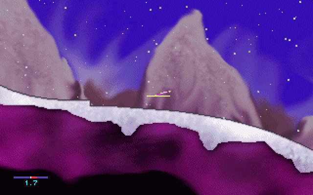
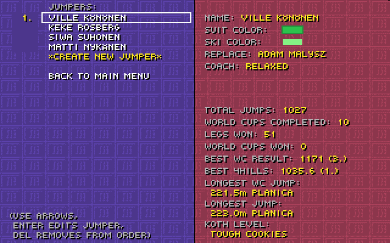
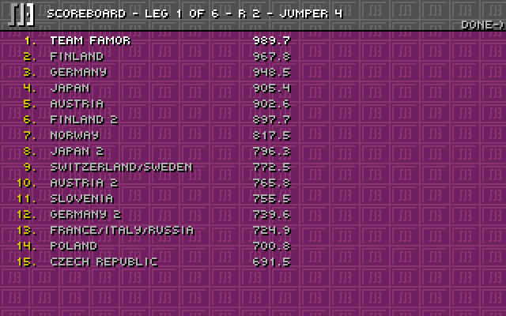

# Research Ski Jump International 3

Stan badania: 16.09.2026. Identyfikatory S01–S18 odnoszą się do [rejestru źródeł](SOURCES.md). To analiza źródeł i obrazów, nie raport z rozegranej sesji.

## 1. Wniosek projektowy

SJ3 dostarcza wyjątkowo dobrego wzorca dla małej gry sportowej: niewiele przycisków, krótka próba, kilka zależnych od siebie decyzji i czytelne porównywanie wyników. Maksymalna inspiracja powinna objąć rytm start–wybicie–lot–lądowanie, turnieje, hotseat i rekordy. Sam śnieg, mały skoczek oraz pikselowy font nie wystarczą do odtworzenia tego doświadczenia.

Nowa gra powinna zachować wymagającą kontrolę skoku, a unowocześnić czytelność, krajobrazy, palety, dźwięk i wygodę uruchomienia. Zgodnie z doprecyzowaniem użytkownika również **zasady sportowe i oznaczenia skoczni mają być współczesne**. Historyczne reguły opisane dalej są materiałem porównawczym. To **wniosek projektowy**, nie wynik badania preferencji graczy.

## 2. Tożsamość i wersje

**FACT:** autorem jest Ville Könönen. SJ3 ukazało się w 2000; autor opisał przejście pełnej gry na freeware 1 grudnia 2013. Obecna witryna odsyła także do otwartego portu SDL2. [Strona autora](https://www.nomasi.com/sj3/), [historia autora](https://www.nomasi.com/sj3/whatsup.html), [download](https://www.nomasi.com/sj3/download.html).

| Wersja | Potwierdzone znaczenie | Źródło |
| ---| ---| ---|
| 3.00, 01.10.2000 | Nowe przewijanie, 20 skoczni, King of the Hill, Hill Maker, Custom World Cup | S05 |
| 3.10, 01.02.2002 | Profile, replaye, zmiana klawiszy, cele odległości, belka treningowa, KO; limit dodatkowych skoczni podniesiony do 1000 | S05 |
| 3.11, 31.12.2003 | Automatyczny zapis replaya rekordu i rozwój zawodów opartych na własnych zestawach | S05 |
| 3.13, 21.03.2011 | Zmiany kwalifikacji i reset wiatru w określonych Custom Cups | S05 |
| Freeware, 01.12.2013 | Udostępnienie funkcji dawnej pełnej wersji bez rejestracji | S07 |
| Publiczny kod DOS / port SDL2 | Materiał do badania zachowania; port deklaruje bardzo dużą zgodność | S09, S16 |

Daty 2011 i 2013 nie przeczą sobie: dotyczą wydania 3.13 i późniejszego modelu udostępniania. Nie nazywamy instrukcji z epoki 3.00–3.10 kompletną specyfikacją 3.13.

## 3. Co robi gracz

Poniższy skrót instrukcji jest historycznym opisem, nie specyfikacją nowej gry. **FACT, S03:** start następuje na zielonym świetle, strzałką w prawo. Gracz może poczekać na wiatr, lecz grozi mu przekroczenie czasu. Wybicie wymaga wyczucia progu; błąd wpływa na ułożenie nart. W locie koryguje się sylwetkę. Telemark daje korzyść punktową kosztem bezpieczeństwa. Rodzaj lądowania, jego przygotowanie i miejsce kontaktu wpływają na wynik. Oficjalny rekord ma inne warunki niż najlepsza próba treningowa.

**FACT, S04:** domyślne klawisze to `↑` — wybicie, `→/←` — pochylenie, `T` — telemark, `R` — lądowanie równoległe. Replay używa strzałek, `P` oraz `+/-`. `F10` w oryginale przerywa zawody bez pytania. Ten ostatni skrót nie jest pożądanym wymaganiem nowej gry. [Quick Guide](https://github.com/suomipelit/skijump3/blob/ba1d5035af483a2c575bb38af64de61322d7e2a5/QUICK.TXT).

## 4. Tryby i metagra

**FACT, S03:** dostępne są trening, World Cup, Custom World Cup, Four Hills, Team Cup i King of the Hill. World Cup prowadzi przez 20 obiektów. Kolejne serie selekcjonują zawodników; finał obejmuje najlepszą trzydziestkę. Gra obsługuje do 10 ludzkich skoczków, drużyny po cztery osoby i eliminowanie najgorszego zawodnika w King of the Hill. Instrukcja opisuje również urazy i własne skocznie.

**FACT, S06:** według FAQ przeciwnicy komputerowi wykonują obliczane skoki; prezentowana miniatura nie jest jedynie dowolnie wylosowaną liczbą. Autor wyraźnie tłumaczy też, dlaczego rekord długości nie gwarantuje prowadzenia: znaczenie mają noty. [FAQ](https://www.nomasi.com/sj3/faq.html).

**FACT, S02:** dodatki społeczności obejmują skocznie, replaye i zestawy konkursów. To wskazówka o znaczeniu powtarzalnej rywalizacji i tworzenia zawartości, ale nie dowód, że pełny edytor musi być pierwszą funkcją nowej gry.

## 5. Istotne ustalenia z kodu

Odczytano wybrane fragmenty publicznego commita, bez kopiowania implementacji do projektu.

| Ustalenie | Dowód | Znaczenie dla projektu |
| ---| ---| ---|
| Raster logiczny 320×200 | S11, granice rysowania | Obrazy 640×400 w galerii nie oznaczają takiej rozdzielczości symulacji |
| Długość opiera się na odległości geometrycznej od progu i skali skoczni | S10: 1297, 2133 | Dystans nie jest po prostu poziomym `x` skoczka |
| Aktywna punktacja długości jest równoważna `180 × d/K − 120` | S10: 2241 | K daje 60 pkt; dla K120 metr daje 1,5 pkt |
| Inny wariant punktowania jest zakomentowany | S10: 2243–2248 | Nie wolno przypisywać grze reguły tylko dlatego, że występuje w tekście kodu |
| Najwyższa i najniższa nota są odejmowane | S10: 2235–2238 | Długość i styl to odrębne składniki |
| Występuje losowanie upadku i rozrzutu not | S10: 2194, 2205–2211 | Pełna zgodność historyczna zawierałaby element losowy; nowy projekt może świadomie go zmienić |
| Wiatr ma stan i zmienia kierunek zmian | S12 | Nie traktować wiatru jako niezależnego losowania co klatkę |
| Replay odczytuje zapisane animacje i wiatr | S13 | Replay nowej gry warto oprzeć również na zapisanym stanie, nie tylko ponownej symulacji |
| Pula ma stałą `NumPl = 75` | S15 | Nie mylić zawodników całej stawki z graczami hotseat |

Przykład kontrolny aktywnego wzoru: dla K120 długości 120,0 m i 130,0 m dają odpowiednio 60,0 i 75,0 punktów za odległość. To obliczenie z odczytanej reguły, nie zmierzony wynik uruchomionego programu.

## 6. Oprawa: obserwacje obrazów

Obrazy poniżej są materiałem historycznym. [Pochodzenie i sumy kontrolne](reference-images/README.md).

**OBSERVED:** kamera pokazuje teren z boku. Skoczek jest mały, krajobraz zajmuje większość ekranu. Granica śniegu jest ważniejsza dla odczytu skoku niż detale skał. Tło ma mocne fiolety, ziarno/dithering i łagodne przejścia, a sprite pozostaje wyraźnie pikselowy. Nie ma podstaw, żeby opisywać oryginał jako sam płaski pixel art bez tonalnych tłach.

**OBSERVED:** menu to pełny ekran gry z tekstowymi listami, prostym obramowaniem wyboru i stałym tłem. Widoczna jest duża gęstość informacji; powtarzający się wzór tła konkuruje z napisami. W nowej grze zachowujemy układ list, lecz uspokajamy tło.

**OBSERVED:** ranking to tabela z wyrównaniem nazw i liczb, a nie kolekcja kart. Żółte akcenty prowadzą uwagę. Profile i wyniki są częścią tej samej oprawy co gra, bez obcego systemowego wyglądu.

Pozostałe obejrzane obrazy pokazują zmianę belki w treningu, konfigurację klawiszy oraz fazy wybicia. Żaden zrzut nie potwierdza liczby klatek animacji, opóźnienia sterowania, sposobu pracy kamery w czasie ani jakości dźwięku.

## 7. Sprzeczności i pułapki

| Problem | Rozstrzygnięcie |
| ---| ---|
| Instrukcja: 15 automatycznych kwalifikantów; changelog 3.13: 10 | Dla opisu zmiany 3.13 pierwszeństwo S05; nowy regulamin zapisany jawnie |
| Instrukcja: 20 własnych skoczni; changelog 3.10: 1000 | Historyczny limit uległ zmianie |
| Starsze materiały proszą o rejestrację | S07 opisuje późniejsze pełne freeware |
| Meter wiatru opisany w różnych rogach | S05 potwierdza konfigurowalne położenie; nie wyciągać wniosku o jednym stałym układzie |
| SJR i rekordy otwartego portu | S16 nie uznaje rekordów portu za kwalifikujące się do dawnych list; nasza gra ma własne rekordy |
| Historyczne K obiektów | S14 to dane gry, nie współczesne homologacje; nie mieszać nazw i wartości z innymi sezonami |
| GPL w repo i dawne zapisy shareware | Różne publikacje z różnych okresów; plan zakłada nowy kod i zasoby, nie automatyczne przejęcie całości |

## 8. Co zachować, co zmienić

| Zachować jako filar | Unowocześnić | Świadoma adaptacja |
| ---| ---| ---|
| Pięć podstawowych akcji skoku | Pełne remapowanie i podpowiedzi z aktualnych bindów | Pauza zamiast natychmiastowego porzucania zawodów |
| Timing, pozycja, wiatr, wybór lądowania | Jasny komentarz po próbie i trening pojedynczych umiejętności | Upadek oparty na warunkach kontaktu, bez ukrytego losowania |
| Pixel art i widok z boku | Szczegółowe, wiarygodne krajobrazy, palety światła, subtelna paralaksa | Roboczy obraz 960×540, większe sprite'y i kwadratowe piksele zgodnie z doprecyzowaniem użytkownika |
| Turnieje, hotseat, rekordy, replaye | Autosave, eksport danych, szybki retry | Własne formaty, fikcyjna obsada, współczesny regulamin Modern 2026.1 |
| Czytelne listy i tabele | Lepsza hierarchia, polskie znaki, dostępność | Przeglądarkowe wyjście z fullscreen i obsługa utraty fokusu |

## 9. Braki dowodowe przed implementacją

W pierwszym pakiecie wykonawczym trzeba rozegrać kontrolowaną sesję SJ3: obejrzeć pełny skok, serię błędów wybicia, reakcję na długie trzymanie strzałki i oba lądowania; zanotować kamerę, rytm ekranów i czas następnej próby. Nie jest potrzebne odtwarzanie każdego współczynnika Pascala. Wartością tego kroku jest porównanie odczucia i rytmu, których dokumenty nie dowodzą.

Nie ma potwierdzonej preferencji użytkownika wobec poziomu losowości, historycznych nazw obiektów i wielkości sprite'a. Dokumentacja przyjmuje konkretne, odwracalne warianty startowe; ich zmiana wymaga aktualizacji decyzji, nie ponownego researchu całej gry.
